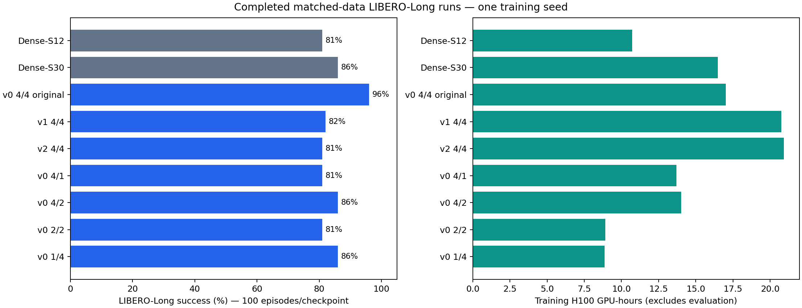
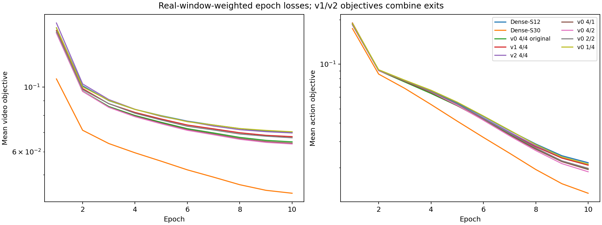

# LoopWAM — consolidated experimental results

**Audit snapshot: 2026-10-08T12:52:59.169087+00:00 (October 8, 2026, approximately 08:53 EDT).**

This is the current consolidated report. It supersedes pending-result statements in older launch reports while preserving those documents as historical records. Results come from server production manifests, timing files, all logged training updates, evaluation summaries and episode records; supporting evidence and reproducible analysis are linked below. The fresh 4/4 repeat remains in progress at this snapshot.

## 1. Findings

- Original Long-only **v0 4/4: 96/100**, the best completed single evaluation among the matched Long runs. Evaluation seeds 42/43/44 give **96%, 88%, 91%**, averaging **91.67% ± 4.04 percentage points** (sample standard deviation) for that one trained checkpoint.
- **Dense-S30: 86%** with 1.416B policy parameters; original v0 uses 0.585B, about **58.7% fewer**. This is an encouraging checkpoint comparison, with no repeated-training-seed evidence yet.
- Recent **4/2 and 1/4 both score 86%**; **2/2 and 4/1 both score 81%**. The 1/4 model trained **36.8% faster than 4/2** on two H100s with the same fully populated VAE cache, but with different microbatches and accumulation.
- A separately trained **single four-suite v0 checkpoint achieves 388/400 (97%)** across Spatial/Object/Goal/Long. It trained on all 1,712 locally available demonstrations, so it is a distinct experiment from the 344/44 Long split.
- The four-suite checkpoint achieves **720/2,000 (36%) on LIBERO-Pro**. **LIBERO-Plus has no valid result** because its preflight failed.
- Measured policy-query latency: released FastWAM **279.90 ms** versus four-suite v0 **260.26 ms** mean, about **7.0% lower** for v0. This is a local timing comparison, with no matched FastWAM simulator SR in the audited results.

## 2. Architecture and training contract

LoopWAM stores 12 block pairs: three prelude, six shared core, three coda. Video/action loop counts specify core repetitions; effective expert depth is `3 + 6K + 3`. Dense-S12 executes 12 independent pairs once. Dense-S30 executes 30 independent pairs once, loading all 30 compact donor layers in order. All models use the native Wan VAE and the compact video/action widths described in the technical plan.

| Variant | Parameters | Video/action effective depth | Supervision |
|---|---:|---|---|
| Dense-S12 | 584,536,135 | 12 / 12 | Final only |
| Dense-S30 | 1,416,114,247 | 30 / 30 | Final only |
| v0 4/4 | 584,536,135 | 30 / 30 | Final only |
| v1 4/4 | 584,536,135 | 30 / 30 | All exits |
| v2 4/4 | 584,536,135 | 30 / 30 | All exits + core XSA |
| v0 4/1 | 584,536,135 | 30 / 12 | Final only |
| v0 4/2 | 584,536,135 | 30 / 18 | Final only |
| v0 2/2 | 584,536,135 | 18 / 18 | Final only |
| v0 1/4 | 584,536,135 | 12 / 30 | Final only |

For v1/v2, the last exit has weight 0.5; each of the first three exits has weight 1/6. For asymmetric v0, action core iteration `r` reads video iteration `max(1, Kv - Ka + r)`. Thus 4/1 reads video loop 4; 4/2 reads loops 3 and 4; 1/4 reuses loop 1 four times. In 1/4, video features are computed once with differentiable KV reuse, so action gradients propagate into the video graph. Actions see observation frames only. Tests cover cached/joint output and gradient agreement, future-frame isolation and checkpoint depth restoration.

Matched Long training: 388 local demonstrations split deterministically into **344 train / 44 validation**, 92,678 training windows/epoch, 11,602 validation windows, ten epochs, **7,250 updates and 926,780 real windows**, global batch 128, seed 42. Each epoch ends with six real windows; padded windows have zero contribution. Initialization uses the same canonical pretrained Wan compact donor artifact with a fresh optimizer; no production run resumes a smoke checkpoint. Changing architecture changes donor-layer usage and computation, even when initialization provenance is shared.

Precision: FP32 policy/master weights and Adam moments with BF16 compute. AdamW: learning rate 1e-4, betas (0.9, 0.95), epsilon 1e-8, weight decay 0.01, 5% warmup and cosine decay, gradient clipping at 1. Data normalization, cameras, video/action offsets and source data hashes were matched by launch gates. “Full dataset” here means the local export; the Long export contains 388 rather than the nominal 500 demonstrations.

## 3. Completed LIBERO-Long results

Every row below uses 100 rollouts of the final 10-epoch checkpoint, evaluation seed 42. Each of ten tasks uses initial states 0–9, a 700-policy-step cap and 30 settling steps, 32-action predictions, replanning every ten actions, ten denoising steps and CFG 1. The recorded episode seed is `42 + task_id*100000 + episode_index*1000`, with the replan index added for policy sampling. Actions use the checkpoint’s training normalizer. The interval is an approximate episode-level 95% Wilson interval, not a training-seed confidence interval.

| Model | SR | 95% interval | H100s | Training | Evaluation | Train GPU-h |
| --- | --- | --- | --- | --- | --- | --- |
| Dense-S12 | 81/100 (81%) | 72.2–87.5% | 4 | 2h 41m 00s | 0h 34m 44s | 10.73 |
| Dense-S30 | 86/100 (86%) | 77.9–91.5% | 2 | 8h 14m 22s | 0h 56m 40s | 16.48 |
| v0 4/4 original | 96/100 (96%) | 90.2–98.4% | 2 | 8h 30m 56s | 0h 44m 07s | 17.03 |
| v1 4/4 | 82/100 (82%) | 73.3–88.3% | 2 | 10h 22m 39s | 0h 59m 46s | 20.75 |
| v2 4/4 | 81/100 (81%) | 72.2–87.5% | 4 | 5h 13m 56s | 0h 40m 55s | 20.93 |
| v0 4/1 | 81/100 (81%) | 72.2–87.5% | 2 | 6h 51m 04s | 0h 55m 14s | 13.70 |
| v0 4/2 | 86/100 (86%) | 77.9–91.5% | 2 | 7h 00m 50s | 0h 52m 42s | 14.03 |
| v0 2/2 | 81/100 (81%) | 72.2–87.5% | 2 | 4h 27m 40s | 0h 58m 34s | 8.92 |
| v0 1/4 | 86/100 (86%) | 77.9–91.5% | 2 | 4h 26m 11s | 0h 57m 11s | 8.87 |



Training time is `elapsed_training_seconds`, including validation/checkpoint work inside the training timer and excluding initial process/model setup. Evaluation time is the full recorded rollout stage including setup and video output. GPU-hours multiply training time by allocated GPU count. Setup, benchmarks, failed sizing trials, smoke checks and evaluation are excluded from training GPU-hours.

Raw wall times are not architecture-only comparisons: v0/v1/Dense-S30 and depth ablations use two H100s; Dense-S12/v2 use four. Earlier runs populated preprocessing caches during epoch 1, whereas the recent 4/1, 4/2, 2/2, 1/4 and fresh 4/4 runs reuse a fully populated frozen VAE cache. Different microbatch layouts also change random-number consumption despite the same seed. The new 4/4 repeat is intended to provide a closer runtime/control comparison under the recent setup.

### Backend and accumulation

| Model | Backend | Microbatch/GPU | Accumulation | GPUs |
| --- | --- | --- | --- | --- |
| Dense-S12 | zero1 | 32 | 1 | 4 |
| Dense-S30 | ddp | 8 | 8 | 2 |
| v0 4/4 original | ddp | 8 | 8 | 2 |
| v1 4/4 | ddp | 8 | 8 | 2 |
| v2 4/4 | ddp | 8 | 4 | 4 |
| v0 4/1 | ddp | 8 | 8 | 2 |
| v0 4/2 | ddp | 8 | 8 | 2 |
| v0 2/2 | ddp | 16 | 4 | 2 |
| v0 1/4 | ddp | 16 | 4 | 2 |

The recent 4/2, 2/2, 1/4 and fresh 4/4 searches compared DDP, ZeRO-1 and ZeRO-2 while preserving parameter/optimizer precision and global batch. DDP won the tested configurations. Larger batches that exceeded GPU memory were rejected before production. Short benchmark rankings and full-run timing can differ because of storage and system variation; these measurements do not establish a universal optimum.

### Per-task Long success (out of ten)

| Task | Dense-S12 | Dense-S30 | v0 4/4 original | v1 4/4 | v2 4/4 | v0 4/1 | v0 4/2 | v0 2/2 | v0 1/4 |
| --- | --- | --- | --- | --- | --- | --- | --- | --- | --- |
| 0 | 6 | 8 | 9 | 8 | 7 | 5 | 7 | 6 | 9 |
| 1 | 8 | 10 | 10 | 10 | 9 | 7 | 10 | 10 | 8 |
| 2 | 9 | 8 | 10 | 9 | 8 | 7 | 10 | 9 | 8 |
| 3 | 10 | 10 | 10 | 9 | 10 | 10 | 9 | 9 | 9 |
| 4 | 7 | 6 | 9 | 7 | 7 | 8 | 9 | 10 | 8 |
| 5 | 10 | 10 | 10 | 10 | 10 | 10 | 10 | 10 | 10 |
| 6 | 8 | 9 | 10 | 5 | 9 | 7 | 5 | 8 | 9 |
| 7 | 8 | 6 | 10 | 6 | 8 | 8 | 9 | 6 | 9 |
| 8 | 8 | 10 | 8 | 9 | 6 | 10 | 10 | 5 | 7 |
| 9 | 7 | 9 | 10 | 9 | 7 | 9 | 7 | 8 | 9 |

0. put both the alphabet soup and the tomato sauce in the basket
1. put both the cream cheese box and the butter in the basket
2. turn on the stove and put the moka pot on it
3. put the black bowl in the bottom drawer of the cabinet and close it
4. put the white mug on the left plate and put the yellow and white mug on the right plate
5. pick up the book and place it in the back compartment of the caddy
6. put the white mug on the plate and put the chocolate pudding to the right of the plate
7. put both the alphabet soup and the cream cheese box in the basket
8. put both moka pots on the stove
9. put the yellow and white mug in the microwave and close it

## 4. Loss behavior and numerical checks

The following objective values are **weighted by real windows over the first and last 100 updates** of each completed run. Last-update-only values are misleading because each Long epoch ends in a six-window batch. v1/v2 objectives aggregate multiple exits and are not identical to final-exit-only losses.

| Run | Video first100 → last100 | Action first100 → last100 |
| --- | --- | --- |
| v0 4/4 original | 0.27849 → 0.06501 | 0.50399 → 0.01905 |
| v1 4/4 | 0.28591 → 0.06772 | 0.52470 → 0.02025 |
| Dense-S12 | 0.29596 → 0.06908 | 0.54614 → 0.02125 |
| v2 4/4 | 0.31958 → 0.06976 | 0.51931 → 0.02111 |
| Dense-S30 | 0.19832 → 0.04321 | 0.46724 → 0.01297 |
| v0 four-suite | 0.31685 → 0.05643 | 0.67816 → 0.01670 |
| v0 4/1 | 0.27477 → 0.06426 | 0.54330 → 0.01875 |
| v0 4/2 | 0.27585 → 0.06389 | 0.51747 → 0.01810 |
| v0 2/2 | 0.28017 → 0.06708 | 0.51579 → 0.01980 |
| v0 1/4 | 0.29784 → 0.07037 | 0.51135 → 0.02118 |



All **86,950 updates across the ten completed production training runs** are present in order, without missing/duplicate update indices; video/action losses and gradient norms are finite. Both objectives decrease substantially. Loss improvement does not guarantee better closed-loop performance: Dense-S30 has lower final loss than v0 but scores 86% versus the original v0’s 96% at seed 42.

The original four-model audit also measured held-out normalized action MSE on only eight fixed validation windows (final v0 0.06274, v1 0.06754, Dense-S12 0.06977, v2 0.06086). This small open-loop diagnostic is not a substitute for simulator evaluation. Tail-batch hidden-state RMS logging is inflated by aggregation over padded physical microbatches; it should not be interpreted as activation explosion. See the [original detailed audit](LoopWAM_Final_Results_20261006.md) for final-exit losses, paired episode outcomes and that diagnostic caveat.

## 5. Evaluation-seed repeatability

One fixed original v0 checkpoint was evaluated again with seeds 42, 43 and 44. The task/initial-state grid is unchanged; diffusion/simulator seeds change. These are **evaluation seeds, not three training seeds**.

| Evaluation seed | SR | Evaluation runtime |
| --- | --- | --- |
| 42 | 96/100 | 0h 50m 01s |
| 43 | 88/100 | 0h 53m 47s |
| 44 | 91/100 | 0h 52m 27s |

Combined: **275/300 (91.67%)**, sample SD across three seed-level scores **4.04 percentage points**. Seed 42 reproduced the original 96/100 aggregate result. The repeated seed-42 execution is not an independent new seed and should not be pooled with the original seed-42 result as if it doubled independent evidence. This variability is a reason to avoid treating small single-seed differences as conclusive.

## 6. One checkpoint trained on all four suites

The full-mixture v0 uses 4/4 loops, 584.5M parameters and one global action/state normalizer. It trains on every locally available demonstration: Spatial 434, Object 457, Goal 433, Long 388 (**1,712 total**). There is no held-out demonstration split in this full-mixture training configuration. One epoch has 277,713 windows; ten epochs complete **21,700 updates / 2,777,130 windows** at global batch 128 on four H100s.

This data volume and training scope differ from the Long-only controls. Its Long score must not be attributed solely to architecture or interpreted as an independent matched 344/44 training result.

| Suite | Success | Evaluation runtime |
| --- | --- | --- |
| Spatial | 99/100 | 0h 17m 12s |
| Object | 99/100 | 0h 15m 18s |
| Goal | 94/100 | 0h 18m 46s |
| Long | 96/100 | 0h 32m 06s |

Overall **388/400 (97%)**. Training: **12h 05m 44s**, **48.38 H100 GPU-hours**. Four-suite evaluation total: **1h 23m 23s**. These standard-suite evaluations use the custom common 700-policy-step horizon, including the easier suites; protocol differences matter when comparing to external publications.

## 7. LIBERO-Pro and LIBERO-Plus

### LIBERO-Pro: completed

The **same single four-suite v0 checkpoint** is used across all four base suites and five perturbation categories. It is not four separately trained suite-specific models. Each category contains 40 tasks × 10 episodes = 400 rollouts; 2,000 total.

| Category | Successes / 400 episodes | SR |
| --- | --- | --- |
| Language | 314 | 78.50% |
| Object | 252 | 63.00% |
| Environment | 101 | 25.25% |
| Task | 53 | 13.25% |
| Swap | 0 | 0.00% |

Per-base-suite Pro success rates, pooling 100 rollouts per category within each suite:

| Base suite | Language | Object | Environment | Task | Swap | All categories |
| --- | --- | --- | --- | --- | --- | --- |
| libero_spatial | 59.0% | 72.0% | 20.0% | 28.0% | 0.0% | 35.8% |
| libero_object | 100.0% | 82.0% | 33.0% | 10.0% | 0.0% | 45.0% |
| libero_goal | 79.0% | 54.0% | 2.0% | 8.0% | 0.0% | 28.6% |
| libero_10 | 76.0% | 44.0% | 46.0% | 7.0% | 0.0% | 34.6% |

Overall **720/2,000 = 36.00%**. Evaluation wall time: **14h 54m 44s** on two H100s. All 2,000 unique suite/task/episode records and nonempty videos were verified. Category counts are 314/400 language, 252/400 object, 101/400 environment, 53/400 task and 0/400 swap.

Protocol: suite-specific caps of **220 Spatial / 280 Object / 300 Goal / 520 Long policy steps**, 30 settling steps, 10 diffusion steps, 32-action predictions and replanning every ten actions. Thus the 36% Pro result and 97% standard-suite result differ in both perturbations and horizons; their gap cannot be assigned entirely to robustness degradation. The **13.25% task-category score is not the overall Pro score**. No matched FastWAM Pro score or verified paper comparison is established by these artifacts.

The 0/400 swap result warrants inspection of category assets, task semantics and failure videos before making a causal claim about the model. Completed execution alone does not explain the failure mechanism.

### LIBERO-Plus: no valid score

The latest attempt failed during preflight with `wand.exceptions.MissingDelegateError: NoDecodeDelegateForThisImageFormat PNG`. Earlier attempts encountered a missing MagickWand library or were cancelled. There is no completed Plus rollout benchmark and no valid Plus success rate. This is an environment/preflight failure, not a measured 0% policy score. The failed queue is not running.

## 8. FastWAM versus LoopWAM latency

Timing uses one H100 80GB, batch one, two 224×224 cameras, 32-action horizon, ten diffusion steps, FP32 weights with BF16 compute, and cached text embeddings with padding masks. Each of two trials has five warmup and 50 timed queries; the table aggregates 100 measured queries/model. Timers synchronize CUDA and include observation preprocessing/transfers, online VAE, visual prefill and action denoising; simulator, text encoding and model loading are excluded.

| Checkpoint | Mean ms | Median ms | P95 ms | Trial means ms |
| --- | --- | --- | --- | --- |
| Released FastWAM | 279.90 | 273.13 | 333.99 | 265.66, 294.13 |
| Four-suite LoopWAM v0 4/4 | 260.26 | 257.18 | 290.95 | 263.69, 256.83 |

LoopWAM has **19.63 ms lower mean latency (7.01%; approximately 1.075× throughput)** in this local measurement. The trial means vary, especially for FastWAM; this is a modest measured difference, not an architecture-independent guarantee. These milliseconds describe a policy query/action chunk, not one executed robot action. Peak allocated memory in those inference trials was approximately 39.07 decimal GB for FastWAM and 3.98 GB for v0, including the loaded model/runtime state in each trial.

The measured v0 checkpoint is the four-suite checkpoint, not the newer asymmetric variants. No isolated latency measurements are available for 4/1, 4/2, 2/2, 1/4 or Dense-S30. Their rollout wall times also reflect episode lengths, simulator rendering and video encoding, so they should not be substituted for query latency. The audited artifacts contain no matched local FastWAM success-rate evaluation; external published scores are intentionally not combined with these local results.

## 9. Fresh 4/4 repeat: ongoing at audit

Allocation **4728.20**, worker-1, two H100s; source `8a29ffdce1537409e2b7e975e838d990ebbe068a`, the same source as the 4/2, 2/2 and 1/4 grid. Same seed 42, Long split, ten epochs, global batch 128, DDP microbatch 8 and accumulation 8. It initializes from the canonical donors and a fresh optimizer, with no checkpoint resume. The full frozen VAE cache is reused.

At the snapshot it had **164/7,250 updates**, with finite losses/gradients. Both native ten-update training checks and two simulator smoke episodes passed. Automatic final evaluation is queued for the final checkpoint, using the same 100-episode Long protocol. Estimated training remains roughly **7½ hours**, then **45–90 minutes** evaluation; the launch estimate was **17:00–17:45 EDT October 8**. This estimate is not a completed runtime or success rate. The repeat uses the same training seed and therefore does not establish across-training-seed variability.

## 10. Interpretation and remaining questions

1. **Weight sharing is promising:** original v0 achieved the highest observed Long seed-42 SR with 58.7% fewer policy parameters than Dense-S30. The original v0’s evaluation-seed range is 88–96%; broader claims require multiple fresh training seeds and matched systems settings.
2. **Additional objectives did not improve the measured final-exit score:** v1=82%, v2=81%, versus original v0=96%. Different GPU layouts and random-number consumption limit a strict attribution to all-exit loss or XSA.
3. **Video/action depth changes the accuracy–cost trade-off:** 1/4 ties 4/2 at 86% with lower measured training time; 2/2 also trains quickly but scores 81%. No dedicated inference-latency measurements support claims about runtime deployment benefits yet.
4. **Standard-suite success does not establish robustness:** the full-mixture checkpoint scores 97% on the standard evaluation and 36% on Pro under different horizons. Investigate swap failures and evaluate matched protocols before assigning causes.
5. **Next evidence to collect:** finish the same-setup 4/4 repeat, repeat training across seeds, measure per-variant query latency, inspect Pro failures, and repair Plus dependencies before reporting Plus results. This report does not launch extra work.

## 11. Audit scope, artifacts and reproducibility

The snapshot includes **ten completed training runs plus one ongoing repeat**, **17 completed evaluation executions**, **3,600 episode records**, and **3,600 nonempty server videos**. The original seed-42 rollout grid appears in two separate executions; these 3,600 records are an execution inventory, not 3,600 independent experimental conditions. Success totals were independently recounted from episode records. Unique keys include suite/category/task/episode, which is essential for Pro because task IDs repeat between base suites.

Every completed run’s update sequence, real-window count, final checkpoint existence and finite losses/gradients were checked. Evaluation episode hashes match their summary checkpoint hash; available evaluation manifests match summaries. Previous production pipelines validate the checkpoint contracts. This audit **does not recompute all multi-gigabyte checkpoint hashes or decode every video again**. The original 400-video audit included ffprobe validation; the new consolidated video check establishes presence and nonzero size only. No claims are made about the visual quality of every rollout.

Videos and model/optimizer checkpoints remain on the H100 server. The report, figures, all episode outcomes and paths, training/evaluation manifests, source/asset hashes, timing/loss summaries and analysis scripts are saved locally and pushed to GitHub. Older launch estimates remain historical; use completed measured times in this report for finished runs.

- [Full server audit snapshot](../evidence/consolidated_20261008/audit.json)
- [Robustness protocol and Plus failure evidence](../evidence/consolidated_20261008/robustness_audit.json)
- [Model comparison CSV](../evidence/consolidated_20261008/models.csv)
- [All 3,600 episodes and server video paths](../evidence/consolidated_20261008/episodes.csv)
- [Weighted loss summary CSV](../evidence/consolidated_20261008/losses.csv)
- [Latency raw trials and aggregate](../evidence/robustness_20261007/latency_aggregate.json)
- [Original four-model audit](LoopWAM_Final_Results_20261006.md)
- [Loop grid launch and speed tests](LoopWAM_v0_loop_grid_20261008.md)
- [Fresh 4/4 launch](LoopWAM_v0_V4A4_repeat_20261008.md)

Rebuild derived tables, checks and figures from the frozen evidence:

```bash
python plans/performance/analysis/build_consolidated_20261008.py
```

To capture a new server snapshot, run `audit_consolidated_20261008.py` on the H100 login host, archive its JSON output, and update the report timestamp. The frozen snapshot is intentionally kept reproducible.

### Checkpoint and source inventory

| Run | Evaluated checkpoint SHA-256 | Training source |
| --- | --- | --- |
| Dense-S12 | `99dd71164a8f1e973df7c183da51fa097857fa31867f62cdfd4f283bd3d01b59` | `012cc8ff305ee067874009e0be705837301f9d4d` |
| Dense-S30 | `7ae8339f2229663054aa6c0f48ed1ad8589e04cb51b32b936a08c32345d77a1f` | `b12085164218211c6b404a7ce2dd92a9dd7d36bf` |
| v0 4/4 original | `d75adef4068d74827921ea35a6bd8d36b5e6ad8b0b84de8dc7ad9e9766486125` | `c35e9d880a5f85d5dd4bee588f8a0cd7fdc777d0` |
| v1 4/4 | `5b893e89864af9f0fc5c8023ddb482bd6d60bb74e137be2ef82f6d7721cad272` | `ccf8a67dc5c479d06a7e0acd64da9da100603e15` |
| v2 4/4 | `15781272e43b9ad9787f312680089b481dee512a718f79b01283cf828c4c0c82` | `012cc8ff305ee067874009e0be705837301f9d4d` |
| v0 4/1 | `32e143c0467faea2717195e2825eed91874c67f1efd54dada2a5be2adafece90` | `d4f1787ed3adeda2361bdca3354c5374ef7f7e56` |
| v0 4/2 | `21ef778748eec09724ad084a0dd2683463ab570d66c49be9de10fb14cc727a8d` | `8a29ffdce1537409e2b7e975e838d990ebbe068a` |
| v0 2/2 | `ba95c076b32c65ed45385452beb17a2f7c2c01b62e693e309e0b02ac1aaac5ab` | `8a29ffdce1537409e2b7e975e838d990ebbe068a` |
| v0 1/4 | `a3fced7752b711251d8cc3caee10825744cc73367ab9964d93ebbe90c5a50c04` | `8a29ffdce1537409e2b7e975e838d990ebbe068a` |

Four-suite/Pro checkpoint: `4ffe1b14f35484ea582189ba0f06c5a41ac199e1fa733b491719727105e5e5cc`. Server root: `/mnt/data/vmo-ai-task/anhdh35/FastWAM/runs/loopwam_nt`. Relative run paths and all manifests are included in the JSON audit.
