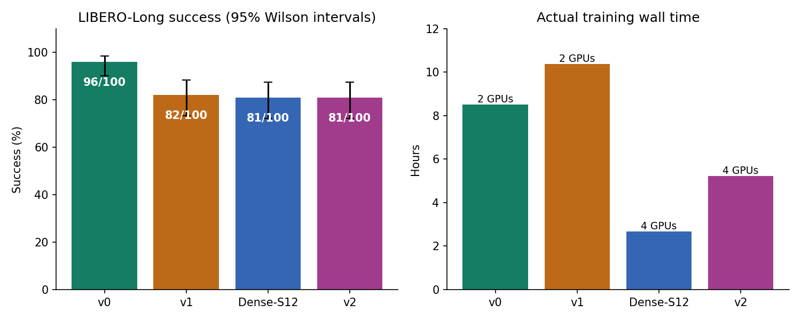
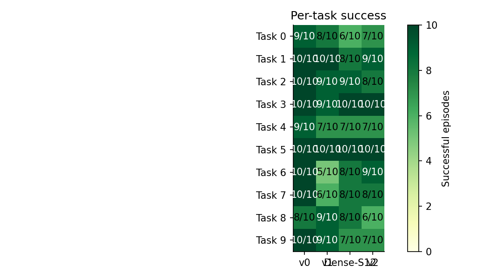
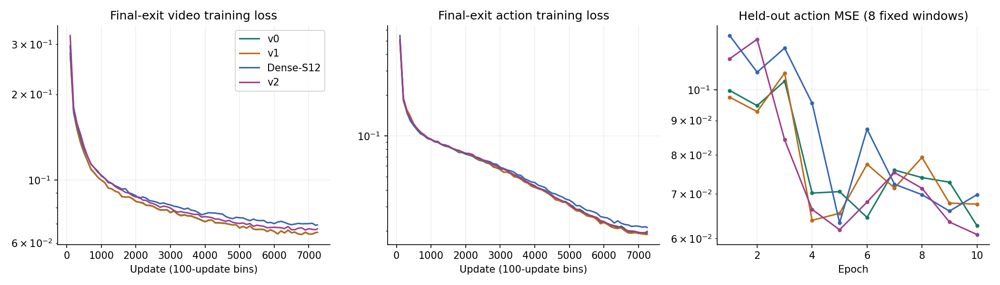

# LoopWAM final results audit — LIBERO-Long, October 6, 2026

Audit timestamp: **2026-10-06T13:01:26.068800+00:00**. All four production runs and their final evaluations are complete. This report supersedes the earlier runtime estimates.

## 1. Main results

| Model | Simulator success | Approx. 95% Wilson interval | Core traversals K | H100 GPUs |
| --- | --- | --- | --- | --- |
| v0 | **96/100 (96%)** | 90.2%–98.4% | 4 | 2 |
| v1 | **82/100 (82%)** | 73.3%–88.3% | 4 | 2 |
| Dense-S12 | **81/100 (81%)** | 72.2%–87.5% | 1 | 4 |
| v2 | **81/100 (81%)** | 72.2%–87.5% | 4 | 4 |

**v0 is the strongest result in this experiment:** +15 percentage points over Dense-S12 and +14 over v1. v2 equals Dense-S12 at 81% and trails v1 by one episode. The present run provides evidence that recurrence with final-exit supervision can help WAM at the same parameter count. It does **not** show an improvement from adding all-exit supervision or core XSA under these settings.

All models contain **584,536,135 trainable policy parameters**. Dense-S12 executes 3 pre + 6 middle + 3 post block pairs once, for 12 effective pairs. v0/v1/v2 reuse the same six middle pairs four times, for 30 effective pairs. v0 uses final-exit supervision; v1 adds joint all-exit supervision; v2 additionally applies XSA in both core experts. For v1/v2, the final exit receives weight 0.5 and each earlier exit receives 1/6.

The Wilson intervals summarize 100 rollout outcomes per checkpoint. There is only **one training seed (42)**, with 10 fixed initial states per task. Episodes share task structure; these approximate intervals do not measure variability across training seeds, and are not a claim of definitive statistical superiority across all settings.

## 2. Actual runtime and GPU usage

| Model | Training loop wall time | Whole training command | 100-rollout evaluation | Training GPU-hours |
| --- | --- | --- | --- | --- |
| v0 | 8h 30m 56s | 8h 31m 21s | 0h 44m 07s | 17.03 |
| v1 | 10h 22m 39s | 10h 23m 04s | 0h 59m 46s | 20.75 |
| Dense-S12 | 2h 41m 00s | 2h 41m 44s | 0h 34m 44s | 10.73 |
| v2 | 5h 13m 56s | 5h 14m 25s | 0h 40m 55s | 20.93 |

Definitions:

- Training loop wall time comes from final `timing.json`: timed training execution including epoch validation and checkpoint work after the training timer starts. It excludes initial model/setup work.
- Whole training command includes initialization and process teardown. v0 uses Slurm step accounting; v1 uses parent stage timestamps; dense/v2 use recorded pipeline stage durations.
- Evaluation wall time is the complete parallel evaluation stage, including setup and video output. v0 includes its brief result verification before cancellation.
- GPU-hours = training loop hours × allocated training GPUs. This is a resource-use accounting quantity, not a hardware-independent FLOP measurement or monetary cost. Benchmarking, earlier abandoned runs and evaluation GPU time are excluded from that column.

**Dense → evaluation → v2 → evaluation finished in 9h 11m 48s.** v1's entire Slurm job, including benchmark/preflight/training/evaluation, took 11h28m. The final fresh v0 training start through evaluation and cancellation took 9h15m37s; its older allocation lifetime also includes setup, benchmarking and an earlier stopped run.

| Model | Backend | Batch/GPU | Accumulation | Warm full update mean (s) | Peak allocated / reserved GB per GPU |
| --- | --- | --- | --- | --- | --- |
| v0 | DDP | 8 | 8 | 3.890 | 59.29 / 61.30 |
| v1 | DDP | 8 | 8 | 4.801 | 73.56 / 78.58 |
| Dense-S12 | ZeRO-1 | 32 | 1 | 1.227 | 80.59 / 82.71 |
| v2 | DDP | 8 | 4 | 2.581 | 77.91 / 78.32 |

Every run uses global batch 128 and FP32 policy/master weights and optimizer moments with BF16 compute. Warm update averages use epochs 2–10 and full 128-window groups. Memory is framework-reported decimal GB; H100 80GB capacity naming uses a different convention, so reserved 82.71 decimal GB is approximately 77.03 GiB and fits the device.

Dense's warm update median was 0.711s, below its 1.227s mean, showing substantial timing variability. Its short winning benchmark of 0.893s/update was optimistic relative to the full run. v2's full warm rate of 2.581s/update closely matched the 2.561s benchmark.

v0/v1 used two GPUs; dense/v2 used four. v2 also reused the fully populated **preprocessing cache** from dense while initializing its policy and optimizer afresh. The other runs populated their caches during epoch 1. Consequently, raw wall-time differences must not be attributed solely to model architecture. v1 took 21.9% longer than v0 on the same two-GPU configuration. v2's shorter wall time than v1 came with approximately the same training GPU-hours.

### Completion times

All dates below are **October 6, 2026**. File timestamp completion markers can precede process teardown by a few seconds.

| Model | Training finished UTC | Evaluation finished UTC | Evaluation finished EDT |
| --- | --- | --- | --- |
| v0 | 07:25:43 | 08:10:00 | 04:10:00 AM |
| v1 | 11:32:10 | 12:31:57 | 08:31:57 AM |
| Dense-S12 | 06:09:09 | 06:43:58 | 02:43:58 AM |
| v2 | 11:58:22 | 12:39:19 | 08:39:19 AM |

## 3. Per-task simulator results

Each entry is successful episodes out of 10. Task IDs follow the installed `libero_10` suite ordering.

| ID | Task | v0 | v1 | Dense-S12 | v2 |
| --- | --- | --- | --- | --- | --- |
| 0 | put both the alphabet soup and the tomato sauce in the basket | 9 | 8 | 6 | 7 |
| 1 | put both the cream cheese box and the butter in the basket | 10 | 10 | 8 | 9 |
| 2 | turn on the stove and put the moka pot on it | 10 | 9 | 9 | 8 |
| 3 | put the black bowl in the bottom drawer of the cabinet and close it | 10 | 9 | 10 | 10 |
| 4 | put the white mug on the left plate and put the yellow and white mug on the right plate | 9 | 7 | 7 | 7 |
| 5 | pick up the book and place it in the back compartment of the caddy | 10 | 10 | 10 | 10 |
| 6 | put the white mug on the plate and put the chocolate pudding to the right of the plate | 10 | 5 | 8 | 9 |
| 7 | put both the alphabet soup and the cream cheese box in the basket | 10 | 6 | 8 | 8 |
| 8 | put both moka pots on the stove | 8 | 9 | 8 | 6 |
| 9 | put the yellow and white mug in the microwave and close it | 10 | 9 | 7 | 7 |

Notable differences:

- v0 achieved 10/10 on seven tasks; its four failures were task 0 once, task 4 once and task 8 twice.
- v1's largest weakness was task 6 (5/10), followed by task 7 (6/10).
- v2 recovered task 6 to 9/10 compared with v1, but dropped task 8 to 6/10 and task 9 to 7/10.
- Every model achieved 10/10 on task 5 (book into the caddy).
- Dense-S12 and v2 have the same overall score but different episode outcomes and task strengths.

### Matched initial-state outcomes

The four models used the same task/episode pairs, initial-state indices and evaluation seed formula. This permits descriptive pairing of rollout outcomes:

| A | B | Both succeed | Only A succeeds | Only B succeeds | Both fail |
| --- | --- | --- | --- | --- | --- |
| v0 | dense_s12 | 80 | 16 | 1 | 3 |
| v0 | v1 | 78 | 18 | 4 | 0 |
| v1 | v2 | 68 | 14 | 13 | 5 |
| dense_s12 | v2 | 70 | 11 | 11 | 8 |

For v0 versus dense, v0 uniquely solved 16 episodes and dense uniquely solved 1. For v1 versus v2, the 14-versus-13 discordant outcomes underline how small the aggregate difference is. These are checkpoint comparisons, not repeated-training-seed experiments.

## 4. Loss trends and held-out diagnostics

The numbers below are **real-window-weighted means over the first/last 100 updates**, avoiding conclusions based on one noisy batch. Main objective losses for v1/v2 combine exits; the final column reports each model's final exit separately.

| Model | Video objective: first 100 → last 100 | Action objective: first 100 → last 100 | Final-exit last 100 video / action |
| --- | --- | --- | --- |
| v0 | 0.2785 → 0.0650 | 0.5040 → 0.0191 | 0.0650 / 0.0191 |
| v1 | 0.2859 → 0.0677 | 0.5247 → 0.0203 | 0.0650 / 0.0186 |
| Dense-S12 | 0.2960 → 0.0691 | 0.5461 → 0.0212 | 0.0691 / 0.0212 |
| v2 | 0.3196 → 0.0698 | 0.5193 → 0.0211 | 0.0672 / 0.0196 |

All production updates were checked; precisely **29,000 updates total** are present, ordered without missing or duplicate update indices. Video/action losses and gradient norms are finite throughout all four runs. Both objectives decrease substantially for every model, although individual updates fluctuate with diffusion noise, timesteps and sample difficulty.

| Model | Held-out action MSE: epoch 1 → epoch 10 | Mean rollout duration (s) | Mean policy steps | Failed rollouts hitting timeout |
| --- | --- | --- | --- | --- |
| v0 | 0.09973 → 0.06274 | 42.42 | 268.43 | 4 |
| v1 | 0.09746 → 0.06754 | 58.61 | 337.74 | 18 |
| Dense-S12 | 0.12040 → 0.06977 | 50.50 | 337.58 | 19 |
| v2 | 0.11122 → 0.06086 | 60.81 | 337.38 | 19 |

Held-out MSE evaluates only **eight fixed windows** from the held-out split, using ten denoising steps and normalized actions. It is a small open-loop diagnostic. v2 obtains the lowest final MSE here but only 81% simulator success, while v0 reaches 96%. Therefore this diagnostic is not a reliable standalone model-selection metric for closed-loop performance.

Episode duration includes policy calls and simulator/rendering work, but excludes video encoding and some setup. Policies also terminate at different steps. These means are **not** isolated neural-network inference latency measurements.

Every unsuccessful rollout reached the 700-policy-step cap. There were no successes during settling alone, so the scores were not inflated by already-complete initial states. The episode logs do not identify why a manipulation failed; attributing failures to grasping, planning or perception requires reviewing the corresponding videos. All 60 failed episodes are indexed in [failed_episodes.csv](../evidence/final_results_20261006/failed_episodes.csv).

### Tail-batch logging caveat

Each epoch contains 724 full 128-window updates and a final **6-window** update. The training loss and gradient normalization account for real windows correctly. However, hidden-state RMS diagnostics are averaged across physical microbatches and subsequently scaled by the real-window denominator, which inflates them on padded tail batches. For example, dense's final logged RMS is much larger than its preceding full-batch RMS (video 0.951/action 0.682). This is a diagnostic aggregation artifact; the report does not treat it as evidence of activation explosion. A future logging cleanup should mask or separately aggregate RMS diagnostics.

## 5. Data, initialization and evaluation protocol

- Dataset: local LIBERO-Long `libero_10_no_noops_lerobot` export, **388 available demonstrations**, split into 344 training and 44 validation episodes by the recorded deterministic task-stratified procedure. This is not the complete 500-demo distribution.
- Each epoch: 92,678 training windows; validation split: 11,602 windows. All runs completed 10 epochs, 7,250 optimizer updates and 926,780 real training windows.
- Fresh initialization: same canonical compact donor artifact from pretrained `Wan-AI/Wan2.1-T2V-1.3B`; no resumed optimizer or smoke checkpoint. Random new action/proprioception heads use seed 42.
- Same normalization hash, VAE hash, dataset content/split and text-cache assets across all four models. Pre-existing text caches do not embed their encoder hash; the earlier source provenance audit is recorded in the manifests, but that cache metadata limitation remains.
- Evaluation: 100 episodes/model, 10/task, distinct initial-state indices 0–9; seed formula 42 + task_id×100000 + episode_index×1000 + replan_index.
- Protocol: 700 policy steps maximum, 30 settling steps, 32-action predictions, execute 10 before replanning, 10 denoising steps, CFG 1, full trained depth (K=1 dense; K=4 looped), the training normalizer, and saved videos.
- Evaluator revisions differ for v1 versus the later generalized evaluator. The reviewed diff changes architecture/version handling and validation metadata; the simulator episode loop, observation/action conversion and termination logic remain the same.

There is no separately trained Dense-S30 or original published FastWAM baseline in this comparison. The current scores cannot establish compression-versus-quality claims against those unmeasured controls or be equated directly with published 500-demo benchmark results. Although the scalar seed is shared, changing GPU count/microbatch changes random-number consumption and noise assignment; the v1/v2 comparison does not isolate XSA as strictly as a matched-layout repeated-seed study would.

## 6. Integrity and operational audit

Verified directly on the server, then checked against the archived results:

1. Complete fresh training manifests and final checkpoint contracts for all four models.
2. Recomputed SHA-256 of each final checkpoint matches the checkpoint evaluated.
3. Exactly 100 unique task/episode pairs/model, ten per task, matching summary, rank and individual episode files; successes independently recounted.
4. All 400 videos are present and nonempty. `ffprobe` reports readable video streams and frame counts equal to policy steps + settling steps + initial frame. SHA-256 inventories are archived.
5. Slurm production steps/jobs completed with exit 0:0. v0 allocation 4689 was deliberately cancelled **after** successful evaluation by the authorized watcher; its interactive shell's cancellation signal is expected.

| Model | Training source | Evaluation source | Final checkpoint SHA-256 |
| --- | --- | --- | --- |
| v0 | c35e9d880a5f | 17ef2c6c6fad | `d75adef4068d74827921ea35a6bd8d36b5e6ad8b0b84de8dc7ad9e9766486125` |
| v1 | ccf8a67dc5c4 | ccf8a67dc5c4 | `5b893e89864af9f0fc5c8023ddb482bd6d60bb74e137be2ef82f6d7721cad272` |
| Dense-S12 | 012cc8ff305e | 012cc8ff305e | `99dd71164a8f1e973df7c183da51fa097857fa31867f62cdfd4f283bd3d01b59` |
| v2 | 012cc8ff305e | 012cc8ff305e | `15781272e43b9ad9787f312680089b481dee512a718f79b01283cf828c4c0c82` |

**v1 status-file artifact:** `job_status.json` retains `exit_code:1` from its deliberately rejected microbatch 16 CUDA-OOM benchmark. The parent log traces that value through later stages without clearing it. Final `stage:complete`, Slurm exit 0:0 and the verified complete results establish successful production. This is stale status metadata, not a failed final run; source evidence is preserved unedited.

**Current resources at audit:** v0 allocation 4689 has been released; v1 batch 4691 ended normally; dense/v2 step 4659.17 completed. The parent interactive allocation 4659 still exists even though this pipeline is finished. `smv-next` 4690 remains pending for resources. This audit does not cancel allocation 4659.

## 7. Interpretation and next experiments

1. **Use v0 as the current best trained checkpoint** for this LIBERO-Long setup. It has the highest measured success and lower training GPU-hours than v1/v2.
2. The main positive finding for LoopWAM is v0's 96% versus dense's 81% at the same 584.5M parameters, with additional recurrent computation. Reproduce this across multiple seeds and a matched GPU/backend setup before making a broad claim.
3. All-exit supervision did not improve the final K=4 score here. Evaluate the trained intermediate exits in a separate evaluation protocol to determine whether v1/v2 offer useful accuracy/latency trade-offs; no such early-exit results are claimed in this report.
4. The plan's video-only/action-only XSA ablations would help locate v2's regressions. The one-episode v1/v2 aggregate difference is too small to support a mechanism-level conclusion from one run.
5. Add a Dense-S30 control if the intended claim includes matching a larger untied model. Keep dataset size, initialization, normalization, simulator protocol and seed comparisons explicit.

## 8. Local and GitHub deliverables

The report, figures, derived CSV tables, source analysis scripts, raw production metrics/manifests/logs, all 400 episode records, and video SHA-256 inventories are archived under [final_results_20261006](../evidence/final_results_20261006). **All 400 videos remain on the H100 server, as requested by the user; they are not copied into Git.** Episode CSVs contain their absolute server paths. The original multi-gigabyte training checkpoints and optimizer shards also remain on the H100 filesystem at the run paths recorded in [remote_audit.json](../evidence/final_results_20261006/remote_audit.json); they are not duplicated into Git.

Useful files:

- [Model summary](../evidence/final_results_20261006/models.csv), [runtime summary](../evidence/final_results_20261006/runtime_summary.json), [epoch metrics](../evidence/final_results_20261006/epochs.csv).
- [Per-task scores](../evidence/final_results_20261006/tasks.csv), [all episodes and server video paths](../evidence/final_results_20261006/episodes.csv), [failed episodes](../evidence/final_results_20261006/failed_episodes.csv), [matched outcomes](../evidence/final_results_20261006/paired_outcomes.csv).
- [Server integrity audit and video hashes](../evidence/final_results_20261006/remote_audit.json).
- Reproduce tables/plots with `python plans/performance/analysis/summarize_final_results.py`; render this report with `python plans/performance/analysis/write_final_report.py` after the archived files are present.
