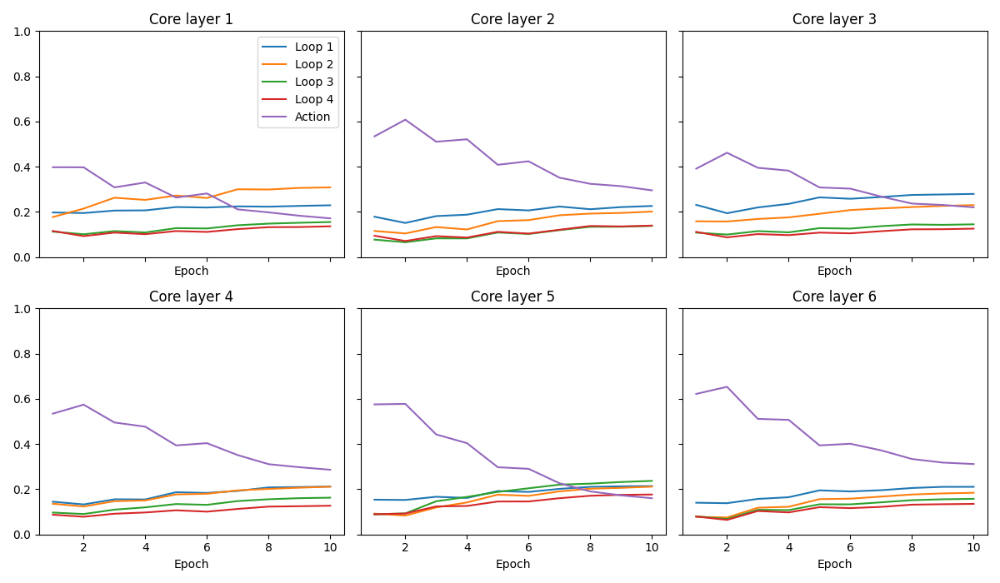
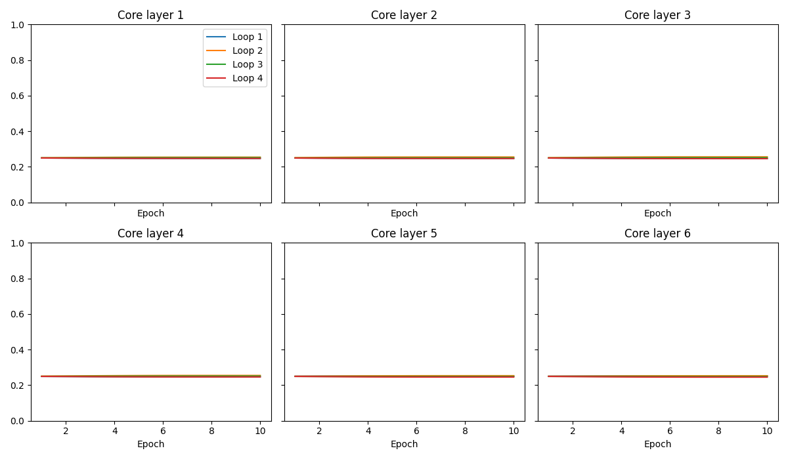

# LoopWAM v0 4/1: all-loop observation KV experiment

> **Scheduling update — October 9, 21:08 UTC:** the user removed all remaining
> inference/evaluation stages. Current full 4/1 and 1/4 training continues;
> dependent jobs **4795 / 4796** train the remaining loop and Dense models only.
> See the [training-only continuation report](LoopWAM_Training_Only_Continuation_20261009.md).
> This supersedes future evaluation scheduling statements below; completed SR
> and the pre-registered Long analysis are unchanged.

> **Updated October 9, 2026, 14:16 UTC (10:16 a.m. EDT).** Concat and mix Long
> training and all three evaluation seeds are complete. The expanded comparison
> is also complete. Jobs 4770 and 4771 have advanced to full-suite aligned 4/1
> and 1/4 training, respectively. Their SR is not yet available.
> The completed-results section below supersedes the historical launch estimates
> and pending-status entries retained later in this report.

## Completed Long results — October 9 update

Both new models were freshly initialized from the canonical Wan donor, with
FP32 weights/optimizer moments and BF16 compute, seed 42, global batch 128,
DDP microbatch 8 × accumulation 8 × two H100s. Each completed ten epochs,
7,250 updates and 926,780 real training windows using the unchanged 344/44 split.
All recorded training losses and gradients were finite; both final fairness checks passed.
Running source remains `3a89bfac5cfccad66bfebbe00014f7f739a78adc`.

### Three-seed success rates

Each seed is a separate 100-episode execution: ten tasks × initial states 0–9.
The protocol remains 700 policy steps, 30 settling steps, action chunk 32,
replan every ten steps, ten denoising steps and CFG 1. Evaluation uses eager
inference with five persistent workers per GPU and preserves sequential task
environment lifecycle. There is no native compiled SR result.

| Model | KV mode | Video/action depth | Calls/chunk | Parameters | Seed 42 | Seed 43 | Seed 44 | Pooled SR | Wilson 95% interval |
|---|---|---:|---:|---:|---:|---:|---:|---:|---:|
| v0 4/1 | aligned | 30/12 | 150 | 584,536,135 | 81% | 88% | 84% | **253/300 = 84.33%** | 79.79%–88.01% |
| v0 4/1 | concat | 30/12 | 150 | 584,536,135 | 83% | 86% | 86% | **255/300 = 85.00%** | 80.52%–88.60% |
| v0 4/1 | mix | 30/12 | 150 | 584,536,423 | 90% | 89% | 87% | **266/300 = 88.67%** | 84.58%–91.78% |
| v0 4/4 original | aligned | 30/30 | 330 | 584,536,135 | 96% | 88% | 91% | 275/300 = 91.67% | 87.99%–94.29% |
| v0 4/4 repeat | aligned | 30/30 | 330 | 584,536,135 | 91% | 85% | 92% | 268/300 = 89.33% | 85.33%–92.34% |

Concat improves by only **0.67 percentage points** over aligned 4/1; its pooled
paired exact McNemar p-value is **0.9036** (35 candidate-only versus 33 baseline-only
successes). Mix is **4.33 points** higher; p = **0.1299** (38 versus 25). Neither
comparison establishes an improvement at a conventional 0.05 threshold. Mix is
numerically strongest among the 4/1 variants, but training-seed variance is unmeasured.

### Expanded seed-42 comparison: completed

Concat's 85% three-seed result lies strictly between the pre-registered 84% and
89% cutoffs, so the original decision is **inconclusive**. This triggered 50
initial states per task, 500 episodes per model, using evaluation seed 42.

| Model | Successes | SR | Wilson 95% interval |
|---|---:|---:|---:|
| concat 4/1 | 404/500 | **80.80%** | 77.12%–84.01% |
| aligned 4/1 | 413/500 | **82.60%** | 79.03%–85.67% |

Concat is **1.8 percentage points lower** on this expanded grid. Paired exact
McNemar: 60 concat-only versus 69 aligned-only successes, **p = 0.4814**.
These results do not demonstrate a benefit from concatenating all video-loop KV.
They also do not establish that the two policies are equivalent or prove that
action depth is the cause. No new follow-up threshold was pre-registered, so
the original **inconclusive** decision is retained.

The expanded seed-42 grid overlaps the first ten initial states per task in the
original evaluation. **Do not pool it with the 300-episode result as independent
evidence.** Mix was not part of this pre-registered expanded comparison.

### Measured training and evaluation runtime

| Model | Training elapsed | Training GPU-hours (2 GPUs) | Mean update | Three-seed evaluation | Expanded 500 evaluation |
|---|---:|---:|---:|---:|---:|
| concat | 7h 34m 18s | 15.14 | 3.738 s | 0h 55m 27s | 1h 32m 42s |
| mix | 7h 18m 22s | 14.61 | 3.610 s | 0h 48m 17s | Not scheduled |

The aligned 500-episode control took **1h 33m 18s**. Training
GPU-hours above are two GPUs multiplied by trainer elapsed time; they exclude
preflight, evaluation and allocation waiting. Evaluation runtime is measured
wall time from each evaluator summary, including worker startup and video output.
Concat took approximately 17.8–19.5 minutes per 100 episodes; mix took 15.9–16.4
minutes. These measured times supersede the earlier 14–15-minute control-based
projection for these two trained policies.

### Loss convergence

Values below are unweighted means across the first and last 100 updates.

| Model | Video first100 → last100 | Action first100 → last100 | Gradient norm first100 → last100 |
|---|---:|---:|---:|
| concat | 0.277464 → 0.063702 | 0.543765 → 0.019361 | 2.635090 → 0.142189 |
| mix | 0.274825 → 0.063925 | 0.542318 → 0.018684 | 2.389038 → 0.136583 |

| Epoch | Concat video | Concat action | Mix video | Mix action |
|---:|---:|---:|---:|---:|
| 1 | 0.153127 | 0.188400 | 0.152837 | 0.187631 |
| 2 | 0.096066 | 0.090914 | 0.096726 | 0.090597 |
| 3 | 0.084662 | 0.078618 | 0.085154 | 0.077603 |
| 4 | 0.078575 | 0.066925 | 0.079070 | 0.065161 |
| 5 | 0.074391 | 0.055322 | 0.074864 | 0.052895 |
| 6 | 0.070789 | 0.044322 | 0.071224 | 0.042126 |
| 7 | 0.068350 | 0.035008 | 0.068748 | 0.033339 |
| 8 | 0.066051 | 0.027850 | 0.066341 | 0.026576 |
| 9 | 0.064542 | 0.022767 | 0.064804 | 0.021931 |
| 10 | 0.063704 | 0.020078 | 0.063942 | 0.019360 |

### Per-task successes across seeds 42/43/44

Each entry is out of 30. Task descriptions and individual episodes are retained
in the raw summaries.

| Task ID | Aligned 4/1 | Concat 4/1 | Mix 4/1 |
|---:|---:|---:|---:|
| 0 | 20 | 26 | 23 |
| 1 | 23 | 29 | 30 |
| 2 | 25 | 25 | 25 |
| 3 | 28 | 27 | 30 |
| 4 | 22 | 24 | 26 |
| 5 | 30 | 30 | 30 |
| 6 | 24 | 20 | 26 |
| 7 | 26 | 26 | 25 |
| 8 | 29 | 26 | 25 |
| 9 | 26 | 22 | 26 |

### Final-checkpoint latency

One H100, batch one, FP32 weights/BF16 compute, ten denoising steps; two trials
of 50 timed queries after five warm-up queries. These are eager policy-query
latencies, not simulator episode times. Stage means do not sum to the total
because the total also includes other inference work.

| Model | Mean query ms | Video prefill ms | Action denoising ms |
|---|---:|---:|---:|
| aligned41 | 118.428 | 18.569 | 85.613 |
| concat | 139.843 | 21.938 | 102.105 |
| mix | 129.967 | 19.128 | 95.894 |
| original44 | 237.776 | 18.370 | 205.187 |

Native BF16 Inductor failed the unchanged numerical-equivalence gate for concat,
mix and the legacy aligned control. Compiled inference and compiled latency
were explicitly disabled for this campaign. Fullgraph capture with the eager
backend was exact; this does not establish Inductor equivalence. The recorded
numerical failures and the reviewed eager-only release audit remain in the
preflight evidence. No compiled speedup is claimed.

### Epoch diagnostics

Concat diagnostics use the same eight held-out windows and explicit FP32
attention probabilities. At epoch ten the mean probability mass is:

| Core layer | Video loop 1 | Video loop 2 | Video loop 3 | Video loop 4 | Action keys |
|---:|---:|---:|---:|---:|---:|
| 1 | 22.91% | 30.83% | 15.50% | 13.62% | 17.14% |
| 2 | 22.61% | 20.14% | 13.80% | 13.92% | 29.53% |
| 3 | 27.95% | 22.98% | 14.49% | 12.58% | 22.01% |
| 4 | 21.21% | 21.14% | 16.27% | 12.73% | 28.64% |
| 5 | 21.39% | 21.17% | 23.72% | 17.67% | 16.04% |
| 6 | 21.08% | 18.45% | 15.77% | 13.53% | 31.17% |

Mix final per-head weights range from **0.2394 to 0.2608** across
all layers, heads and video loops. They remain near the uniform initialization
of 0.25. These diagnostics show that the extra video-loop inputs participate;
attention mass and mixing weights alone do not establish a causal performance mechanism.

### Statistical interpretation and evidence

Unpaired episode-level tests versus original 4/4 (275/300) give p = 0.0110 for
concat and p = 0.2172 for mix. Those tests and the Wilson intervals treat episodes
as independent; repeated tasks and states create clustering. All training uses
one seed (42). The paired tests are unadjusted for multiple comparisons. These
limitations prevent broad claims of superiority, equivalence, or mechanism.

- [Three-seed report and per-seed paired tests](../evidence/kv_concat_20261008/results_20261009/job4770/long_analysis/report.md)
- [Three-seed machine-readable results](../evidence/kv_concat_20261008/results_20261009/job4770/long_analysis/evidence.json)
- [Expanded report](../evidence/kv_concat_20261008/results_20261009/job4770/expanded_analysis/report.md)
- [Expanded machine-readable results](../evidence/kv_concat_20261008/results_20261009/job4770/expanded_analysis/evidence.json)
- [Independent local verification](../evidence/kv_concat_20261008/results_20261009/verification.json)
- [Current full-suite training snapshot](../evidence/kv_concat_20261008/results_20261009/current_training_snapshot.json)

Local verification independently checked **14,500 training updates**, **1,600 new
final evaluation records**, and the **300-episode aligned control**, including
episode identity, summary-to-record consistency, checkpoint binding, fixed
protocol, fresh training budgets, finite metrics, loss aggregates, Wilson
intervals, paired exact McNemar, latency samples and the unchanged decision.
Counts refer to executions; the 1,600 new records include the overlapping
expanded seed-42 grid. Weights, videos and latent tensors remain on the server.

### Full-suite campaign status at this snapshot

| Job | Current stage | Update / 21,700 | Next stages after three-seed evaluation |
|---|---|---:|---|
| 4770 | Aligned 4/1 full-suite training | 1,385 / 21,700 | Aligned 3/3 → Dense-S12 |
| 4771 | Aligned 1/4 full-suite training | 2,630 / 21,700 | Aligned 2/2 → Dense-S30 |

Both full-suite trainings use all four suites and global batch 128. Each model
will evaluate seeds 42/43/44 before its queue advances. No full-suite SR from
any of these six new runs is reported yet. The immutable running source is
unchanged by this documentation update.

---

## Historical specification and implementation record

The following pre-registration and dated development entries are preserved.
Earlier forecasts and pending statements describe their original checkpoints
in the work; use the completed-results section above for current status.
## Pre-registration — October 8, 2026

Base: `8d74c8df2eca4d165626830d90c2cc9bc56412b6`, fetched from the
`LoopWAM_NT` branch of `anhdao69/LoopWAM_NT` (local remote alias `loopwam`).
Implementation branch: **KV_concat**. The base branch is not merged into or
rewritten. The previous full-suite launch is preserved as historical evidence.

This tests access to the video trajectory while holding action depth at 12 block
applications. Concat and mix use video/action loops 4/1 and 30/12 effective depth.
Concat has no new parameters; mix adds 6 layers × 12 heads × 4 logits = 288.
All-loop KV contains only clean observation tokens, after the existing RoPE.
Prelude/coda conditioning stays unchanged. Default `aligned` behavior and old
checkpoints must be preserved.

### Decision rule fixed before new concat/mix outcomes

- Pooled concat SR **≥89% over 300 episodes**: **access hypothesis supported**;
  the 4/1 deficit is mainly lack of access to the video loop trajectory.
- Pooled concat SR **≤84%**: **action-depth hypothesis supported**.
- Otherwise: **inconclusive**; evaluate concat and aligned 4/1 using 50 initial
  states per task (500 episodes) before deciding. Use evaluation seed 42 for
  this prespecified expanded grid, report separately, and retain the original
  three-seed result. No new post hoc threshold is introduced for that grid.

These are the user's operational decision thresholds, not a causal proof.
All models use one training seed (42); training-seed variance is unmeasured.

## Fixed contract

Concat/mix: Long 344/44 split, 92,678 training windows/epoch, 10 epochs,
7,250 updates, 926,780 real windows, global batch 128, fresh canonical Wan
initialization and optimizer. AdamW 1e-4, (0.9,0.95), eps 1e-8, decay 0.01,
5% warmup/cosine and clip 1.0. FP32 weights/moments, BF16 compute. Prefer the
baseline DDP microbatch 8 × accumulation 8 on two H100s; record any necessary
layout deviation. Mix logits alone have zero weight decay.

Evaluation seeds **42/43/44**, each ten tasks × ten initial states, 700 policy
steps, 30 settling steps, chunk 32 / replan 10 / denoising steps 10 / CFG 1. Checkpoint hashes,
all episode identities/outcomes and videos are retained. Baseline 4/1 seeds 43/44
are required; repeat seed 42 is an evaluator reproduction check and is not
additional independent evidence. Also evaluate the fresh 4/4 repeat at 43/44.

## Expanded two-job campaign

The user superseded jobs 4768/4769 shortly after verified production startup.
Those runs were cancelled solely to reorder this user's work; output directories
were preserved. Replacement allocations are **4770 (worker-0)** and **4771
(worker-1)**, two H100s, 32 CPUs, 256 GiB each. They wait for verified launch scripts.

Provisional balanced order (four training runs each):

1. 4770: concat Long → full 4/1 → full 3/3 → full Dense-S12.
2. 4771: mix Long → full 1/4 → full 2/2 → full Dense-S30.

Every model trains then evaluates before the next model. Both Long experiments
must complete before either job advances to the full suite phase. All full runs
use 1,712 available demos, 277,713 windows/epoch, 10 epochs, 21,700 updates, global batch 128,
and three evaluation seeds 42/43/44 across all four suites (1,200 episodes/model).
Every training starts fresh. Previous short production weights are not resumed.

## Status

Implementation and verification are in progress. No concat/mix training results,
latency measurements, or final success rates are claimed. Measured tests,
throughput, fairness gates and launch estimates will be appended. The campaign
will generate the final statistical report from complete episode records.

## Implementation status (2026-10-08, pre-production)

Branch `KV_concat` has been pushed. The immutable server candidate is commit
`6fa606d`; base `LoopWAM_NT` remains `8d74c8df2eca4d165626830d90c2cc9bc56412b6`.
No production training has been released at this snapshot.

### Implemented

- Differentiable observation-prefix caches from every video virtual layer;
  ascending-loop concat and FP32 per-head KV mixing after RoPE.
- Existing aligned execution paths retained; exact output/gradient comparisons
  against the base source cover the old loop and dense architectures.
- Mode-aware checkpoint/factory/evaluation guards; absent fields mean aligned.
  Mix logits are strictly restored and have a separate zero-weight-decay group.
- Fixed eight-window heldout concat diagnostics and per-head mix weights each
  epoch; diagnostics restore RNG, model mode, and latent-cache attachment.
- Eager/compiled latency instrumentation with video-prefill and action-denoising
  breakdowns; two trials of 50 queries after 5 warmups.
- Two continuous four-run queues, source/fairness/completion gates, automatic
  seeds 42/43/44 rollouts, Long completion barrier, optional 500-state follow-up,
  and automatic Long/full-suite reports. Checkpoints/videos stay on the server.

### Verification evidence so far

- Core numerical tests:45 passed, 2 GPU skips.
- Mode/checkpoint/optimizer integration:51 passed, 2 GPU skips at that snapshot.
- Whole CPU regression after metadata/fixture fixes:373 passed, 9 skipped.
- First whole GPU run:386 passed, 1 statistics-fixture failure; compiled concat/mix
  tests passed. The failure concerned Wilson interval boundary precision; its
  corrected endpoint and expected interval were verified in targeted tests.
  Final pinned CPU/GPU reruns are required before release.
- Reporting/review tests:7 passed remotely; local end-to-end report/plots plus
  supplemental/identity/statistics tests:5 passed.
- Independent whole-branch review found no core attention/autograd defect. Its
  two Important reporting gaps were fixed: expanded 500 results now receive a
  supplemental report, and the six full-suite models receive a final combined
  report. Final report directories are published only after successful assembly.
- A Dense-S30 fixture failure reproduced on the pre-change source: its fixture
  omitted required architecture/donor metadata. The fixture was corrected;
  production validation was not weakened. Legacy callers without a KV option
  retain their original training-contract schema.

### Initial control measurements — evaluator reproduction failed

| Model | Evaluation seed | Long successes |
|---|---|---|
| Fresh 4/4 repeat, unaccepted episode queue |43|87/100|
| Fresh 4/4 repeat, unaccepted episode queue |44|91/100|

| Model | Eager total ms | Video-prefill ms | Action-denoising ms |
|---|---:|---:|---:|
| Existing aligned 4/1 |118.428|18.569|85.613|
| Original 4/4 |237.776|18.370|205.187|

Latency uses one H100, batch 1, FP32 weights/BF16 compute,100 timed queries in two
trials. Total includes observation preparation, online VAE and transfers.
Stage values use CUDA events; total uses synchronized wall time.

### Queue order

| Job | GPU pair | Run1:Long | Run2:full | Run3:full | Run4:full |
|---|---|---|---|---|---|
|4770|worker-0,2H100|concat4/1|aligned 4/1|aligned3/3|Dense-S12|
|4771|worker-1,2H100|mix4/1|aligned1/4|aligned2/2|Dense-S30|

Every run starts from canonical donors with a fresh optimizer, seed 42, global
batch 128 and 10 epochs. Both Long runs and their three evaluations finish before
full-suite work starts. Long prefers baseline DDP microbatch 8 / accumulation 8 if
it fits; full-suite layouts are selected by measured valid throughput.

Native cold/warm smokes, sizing/throughput benchmarks, simulator smokes and
fairness gates remain pending. The final finish-time estimate will be updated
from those measurements. SSH became intermittent during preflight launch;
no production release file has been written.

## Evaluation lifecycle gate failure and diagnosis

After SSH recovered, the old episode-parallel evaluator scored the unchanged
4/1 checkpoint 79/100 at seed 42, versus historical 81/100. The checkpoint SHA-256
matched exactly. Tasks 3 and 8, initial state 2, changed from success to failure;
only 75 of 100 episode step counts matched. These control runs are **not accepted**
for the planned comparison. Their raw evidence is retained.

The original evaluator reproduced task 3 episodes 0–2 exactly (230/217/224 steps).
Giving the parallel evaluator the original four CPU/render threads did not fix
its different trajectories (230/206/700 steps). It dispatched later initial
states into fresh environments, whereas the original evaluator reuses one
environment for all initial states of a task. The correction schedules entire
task/round sequences, preserves increasing initial-state order, and creates a
new environment for each round. Model and sampler math are unchanged.

Campaign preflight GPU steps 4770.3 and 4771.1 were stopped; allocations 4770/4771
remain reserved. The pinned CPU suite passed 381 tests with 9 skips. Production is
still blocked until simulator reproduction, revised concurrency measurements,
and all remaining native gates pass. The earlier short 100-step concurrency
probe was insufficient to establish full-horizon evaluator equivalence.

The corrected grouped evaluator reproduced all six diagnostic episodes exactly
(outcomes and step counts), including the two previous failures. Full 100-episode
reproduction and concurrency tests are in progress. Release validation now checks
accepted control summary hashes, model contracts, seed coverage and evaluation
settings before the first training command. Slurm entrypoints require explicit
verified worker and render-thread counts. Targeted lifecycle/release tests: 5 passed.

## Accepted evaluator reproduction gate

Pinned source: `d223427` (subsequent evidence-only commits do not change code).
Full CPU regression: **384 passed, 9 skipped**.

| Configuration | H100 worker | 100-episode time | Seed 42 SR |
|---|---|---:|---:|
| 4 model workers/GPU, 4 render threads | worker-0 | 1,002.791 s (16m 43s) | 81/100 |
| 5 model workers/GPU, 3 render threads | worker-1 | 869.617 s (14m 30s) | 81/100 |

Both configurations reproduced all 100 historical success outcomes, step counts
and replan counts exactly. Their 100 action traces were bit-identical. The latter
configuration was 13.3% faster in this trial and is selected for the campaign.
This is one timing trial on each of two workers; host variability is not isolated.

Raw summaries and the machine-readable gate are in
`plans/evidence/kv_concat_20261008/evaluator_reproduction/`. Videos and action
trace arrays remain on the server. Old episode-parallel controls remain rejected.
GPU regression and new task-sequence control evaluations are running in steps
4770.6 and 4771.6, followed by native training preflight. Production is not released.

GPU regression on the same pin passed on both allocations: **393 passed** on
worker-0 (62.17 s), **393 passed** on worker-1 (90.26 s), no skips or failures.
Logs are archived under `plans/evidence/kv_concat_20261008/pinned_d223427/`.
These include the GPU fullgraph concat/mix unit tests; native checkpoint
compilation/latency checks remain separate pending gates.

## Accepted control evaluations

The corrected task-sequence evaluator completed 200 new episodes for each control.
Aligned 4/1: seed 43 **88/100**, seed 44 **84/100** (28m 03s combined). Together
with the exactly reproduced seed-42 baseline **81/100**, this is **253/300
(84.33%)**. The 4/4 fresh repeat scored **85/100** and **92/100** at seeds 43/44
(27m 55s combined); its historical seed-42 score is 91/100, giving **268/300
(89.33%)**. These replace the rejected episode-pool controls.

| Task | Aligned 4/1, seeds 42/43/44 (out of 30) | Repeat 4/4, new seeds 43/44 (out of 20) |
|---|---:|---:|
| 0 | 20 | 17 |
| 1 | 23 | 20 |
| 2 | 25 | 19 |
| 3 | 28 | 20 |
| 4 | 22 | 13 |
| 5 | 30 | 20 |
| 6 | 24 | 14 |
| 7 | 26 | 20 |
| 8 | 29 | 15 |
| 9 | 26 | 19 |

Training sizing is in progress. Initial eight-update DDP8 benchmarks measured
3.607 s/update (concat) and 3.632 s/update (mix), with finite losses/gradients.
DDP16 exceeded H100 memory for both modes. This is a recorded sizing result;
the required baseline DDP8/accumulation8 layout fits. Native cold/warm training,
simulator smokes and fairness verification remain required before production.

## Final preflight on immutable source `3a89bfa`

The previous prepared pin was replaced to require at least one valid timing for
**each** of DDP, ZeRO-1 and ZeRO-2 before selecting a backend. All eight models
now have that coverage. Oversized microbatch OOMs are retained as sizing evidence;
no training contract was reduced. CPU regression: **385 passed / 9 skipped**.
GPU regression: **394 passed on each allocation**, including tiny-model compiled
inference. Raw logs are under `pinned_3a89bfa/` in the evidence directory.

| Job / order | Experiment | Data | DDP microbatch × accumulation × GPUs | Native seconds/update | Projected training hours |
|---|---|---|---|---:|---:|
| 4770 / 1 | v0 4/1 concat | Long 344/44 | 8 × 8 × 2 | 3.608 | 7.27 |
| 4770 / 2 | v0 4/1 aligned | Full four suites | 8 × 8 × 2 | 3.379 | 20.37 |
| 4770 / 3 | v0 3/3 aligned | Full four suites | 8 × 8 × 2 | 2.954 | 17.80 |
| 4770 / 4 | Dense-S12 | Full four suites | 16 × 4 × 2 | 1.668 | 10.05 |
| 4771 / 1 | v0 4/1 mix | Long 344/44 | 8 × 8 × 2 | 3.629 | 7.31 |
| 4771 / 2 | v0 1/4 aligned | Full four suites | 16 × 4 × 2 | 1.869 | 11.26 |
| 4771 / 3 | v0 2/2 aligned | Full four suites | 16 × 4 × 2 | 2.106 | 12.70 |
| 4771 / 4 | Dense-S30 | Full four suites | 8 × 8 × 2 | 3.811 | 22.97 |

All use global batch 128, seed 42, ten epochs and fresh initialization/optimizer.
Long experiments retain baseline DDP8/accumulation8 exactly. Full runs use the
fastest valid measured candidate. The ten-update native timings above are short
projections, not completed training measurements. Dense-S12's short native timing
is slower than its 1.367-second benchmark; the ETA uses the native figure.
Training-only totals: **55.49 h (4770)** and **54.24 h (4771)**.

All eight fresh warm-cache 10-update runs passed finite-loss/gradient, manifest,
window/update-budget and baseline asset/data/init fairness checks. Both new KV
modes also passed fresh cold-cache 10-update runs, held-out diagnostics with RNG
and model state unchanged, and two simulator smoke episodes with videos. Each
full-suite configuration passed eight smoke episodes (two tasks per suite,
100-step smoke cap). These short untrained-policy rollouts test execution, not SR.
Final evaluations retain the full benchmark protocol and seeds 42/43/44.

### Native compilation limitation and explicit eager inference

Native H100 BF16 Inductor inference **failed** the fixed `atol=rtol=0.002`
comparison. This failure is preserved and is not counted as a passed gate:

| Checkpoint | Maximum absolute final-action difference | Repeat compiled output |
|---|---:|---|
| concat, 10-update smoke | 0.02783203125 | Bit-identical |
| mix, 10-update smoke | 0.01318359375 | Bit-identical |
| existing aligned 4/1 baseline | 0.0152587890625 | Bit-identical |

Boundary instrumentation compares video prefill caches and each denoising call
on identical inputs. Inductor differences occur in both stages and also in the
legacy aligned control. Fullgraph capture using `backend="eager"` matches every
instrumented tensor and the final actions **exactly** for concat and mix. This
isolates the discrepancy to the Inductor execution path; the precise generated
kernel responsible has not been identified. Tiny FP32 compiled tests passing does
not establish native BF16 numerical equivalence.

As explicitly permitted by the specification's compiled-path fallback, this
campaign uses **eager inference only**, including final simulator evaluation and
reported latency. No tolerances, weights, precision settings, or training contract
were changed. `native_compiled_verified=false` suppresses compiled latency runs.
The release audit records `native_inductor_gate_passed=false` and scopes its pass
to `eager_production_release`. Fullgraph capture itself works, but native Inductor
is not verified for this comparison. Any later compiled timing must be labeled
separately and must not be interpreted as matching the accepted eager SR.

The first helper invocation failed because login-node `/tmp` is not shared with
worker nodes. The helper was moved to shared storage and rerun; both launch logs
are retained. This occurred before production release.

## Production release and finish estimate

The reviewed eager-only audit passed and both launch files were published at
**2026-10-09 01:16:50 UTC (October 8, 9:16:50 p.m. EDT)**. Jobs **4770**
(worker-0, concat queue) and **4771** (worker-1, mix queue) each hold two H100s,
32 CPU cores and 256 GiB host memory, with a 120-hour time limit. Source is pinned
to `3a89bfac5cfccad66bfebbe00014f7f739a78adc`; later documentation commits do not
change running code. Audit SHA-256:
`6f7d2492286c7a1f5bdd35041090f9b2df77105a0ad95003879ffd5c904ea634`.

Both start fresh canonical donor training, not a smoke or trained checkpoint.
Every training stage automatically runs three separate final evaluations at
seeds 42/43/44 before advancing. The two Long experiments finish their evaluation
and analysis before either queue starts its full-suite stages. An inconclusive
concat result triggers the pre-registered expanded seed-42 500-episode evaluation
for concat and aligned 4/1, preserving the original 300-episode decision.

**Forecast from release:** approximately **65–72 hours** through all eight
trainings and all scheduled evaluations, or **October 11, 2:15–9:15 p.m. EDT**
(18:15 UTC October 11 to 01:15 UTC October 12). Add roughly **2–3 hours** if the
expanded Long follow-up is triggered. Initial Long training plus three-seed
results should be available in approximately **8–9 hours** (October 9,
5:15–6:15 a.m. EDT), excluding the optional expanded follow-up.

This forecast combines measured short native update times with conservative
rollout/checkpoint overhead. Evaluation timing is extrapolated from the measured
869.6 seconds per 100 Long episodes; full-suite task lengths and model depths
vary. Shared-storage and cluster contention can shift the estimate. It is not
a guaranteed completion time or a completed-run runtime measurement. Both jobs
exit and release their allocations naturally when their pipelines finish; no
external jobs are canceled. On a failed stage the pipeline stops instead of
continuing with incomplete evidence.

The automatic Long report and full-suite report will be written on the server
under `campaign_3a89bfa/long_analysis` and `campaign_3a89bfa/full_analysis` in
job 4770. Final model checkpoints and videos stay on the server. Final SR,
statistical decisions and final-checkpoint KV latency remain pending training.
